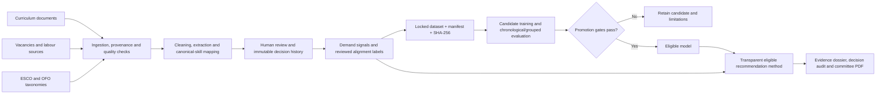

# FUTURE Platform — System Architecture

> Audience: operators, reviewers, examiners, and maintainers.  
> Last verified: 2026-10-01.  
> Companion guides: [END_TO_END_SYSTEM_GUIDE.md](END_TO_END_SYSTEM_GUIDE.md),
> [USER_GUIDE.md](USER_GUIDE.md), and [DEVELOPER_GUIDE.md](DEVELOPER_GUIDE.md).

## 1. Purpose and operating principle

FUTURE implements the Predictive Curriculum–Labour Market Alignment System (PCLMAS). It combines
curriculum evidence, labour-market evidence, and occupational taxonomies to support alignment and
skills-gap decisions.

It is a decision-support system. A score or recommendation does not amend a curriculum. Evidence is
reviewed, decisions require a reason, and the system retains the user, timestamp, provenance, method
identity, and history.

## 2. End-to-end architecture

The recommendation record always discloses the method/model that produced it. A failed candidate
does not become active and is not presented as the source of recommendations.

## 3. Runtime components

| Layer | Technology | Responsibility |
| --- | --- | --- |
| Browser portal | Vanilla HTML, CSS and JavaScript | Role-aware operational workflows |
| Reverse proxy | NGINX | Static files and `/api` routing |
| Application API | Python, FastAPI, Pydantic | Validation, orchestration, permissions and audit |
| Persistence | PostgreSQL 16, SQLAlchemy, Alembic | Evidence, identities, decisions, jobs and model registry |
| Vector search | pgvector with JSONB fallback | Semantic retrieval and similarity support |
| Classical ML | XGBoost, scikit-learn, pandas, NumPy | Alignment candidate training and evaluation |
| Forecasting | TensorFlow/Keras LSTM | Demand-forecast candidate evaluation |
| Explainability | TreeSHAP | Feature-level explanations for eligible tree models |
| Document/text processing | pdfplumber, spaCy, TF-IDF | Extraction, normalisation and descriptive gap scoring |
| Packaging | Docker Compose | PostgreSQL, backend and NGINX services |

Long-running processing and model jobs are durable. The portal submits work and then polls status;
the browser request is not the job itself. A gateway timeout must therefore not be interpreted as
proof that a job failed—the operator checks durable job status before retrying.

## 4. Main data domains

| Domain | Representative records |
| --- | --- |
| Identity and access | user, role, permission, session, audit event |
| Source ingestion | data source, connector, ingestion job, raw record, source contract, quality check |
| Curriculum | document, version, chunk, programme, module, subject profile |
| Labour market | job posting, trend fact, demand signal, demand-evidence row |
| Skills and taxonomies | canonical skill, alias, ESCO/OFO link, skill mapping, mapping review |
| Alignment governance | review task, reviewed label, locked dataset snapshot and rows |
| Predictive registry | candidate, evaluation result, promotion decision, predictive output |
| Decision support | recommendation, evidence dossier, review decision, status history, report |

Thousands of skill mappings are not thousands of alignment training rows. A training row is a
reviewed curriculum-evidence/demand-evidence comparison with a 1–5 label. This distinction is
essential when interpreting dataset size.

## 5. Request and security flow

1. NGINX serves the portal on port 8080 and proxies `/api/*` to FastAPI.
2. FastAPI validates the JWT session, tenant scope, role and permission.
3. A router validates the request and delegates to a service.
4. The service writes through SQLAlchemy to PostgreSQL.
5. Sensitive actions create append-only audit/history records.
6. The API returns a Pydantic-serialised response to the portal.

The five implemented roles are Viewer, Analyst, Data Scientist, Curriculum Approver and
Administrator. Final academic recommendation decisions require the Curriculum Approver role;
administrator privileges do not silently bypass that control. Secrets must be supplied by the
deployment environment, and production traffic requires TLS.

## 6. Model lifecycle and leakage controls

1. Review alignment labels in the portal.
2. Resolve applicable disagreements without overwriting earlier decisions.
3. Lock a snapshot with its manifest and SHA-256 fingerprint.
4. Train only from that immutable snapshot.
5. Evaluate using chronological and grouped folds; fit preprocessing inside each training fold.
6. Record class balance, fold stability, leakage checks, calibration, metrics and limitations.
7. Promote only when every declared gate passes. Otherwise retain the candidate as technical
   evidence and continue using an explicitly identified eligible method.

TreeSHAP is the supported explanation method for eligible XGBoost outputs. The legacy LIME field is
kept empty only for schema compatibility.

## 7. Current verified state

- Locked reviewed alignment snapshot: **993 rows**, **40 positive (4.03%)**.
- XGBoost candidate: worst chronological-fold F1 **0**; mean chronological-fold F1 **0.0192**;
  expected calibration error **0.1184**.
- Promotion result: **blocked**; the candidate is retained as technical evidence.
- Current audited recommendation method: `canonical_signal_weighted_baseline_v2`.
- The portal retains recommendation evidence, provenance, reasons, users, timestamps and history.
- A Curriculum Approver can generate an immutable committee report and download the PDF. The portal
  exposes the report ID, source-manifest/hash context and payload SHA-256.

This proves the technical mechanism can ingest, review, lock, train, evaluate, gate, recommend,
audit and export. It does not establish predictive generalisability. Broader programme and
institutional evidence belongs to future empirical validation.

## 8. Operator surfaces

| Portal surface | Primary purpose |
| --- | --- |
| Data Operations | ingest, process, review mappings, build demand evidence, label and lock datasets |
| Skills Alignment | inspect curriculum/labour mappings and gaps |
| Demand Outlook | inspect generated labour-demand signals |
| Model Lab | train, evaluate, inspect registry and promotion gates |
| Recommendations | inspect dossiers, decide, view history and generate the committee pack |
| Reports & Exports | retrieve immutable reports and exports |
| System Operations | health, performance, backup, restore and portal UAT |
| User Administration | approve users and assign least-privilege roles |

For exact click-by-click procedures, use the deployed Help Manual. For endpoint and recovery detail,
use [END_TO_END_SYSTEM_GUIDE.md](END_TO_END_SYSTEM_GUIDE.md).
