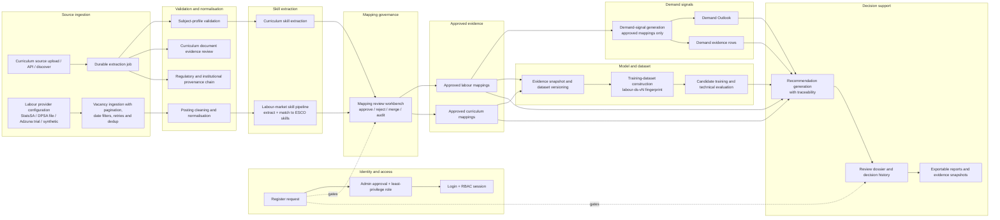
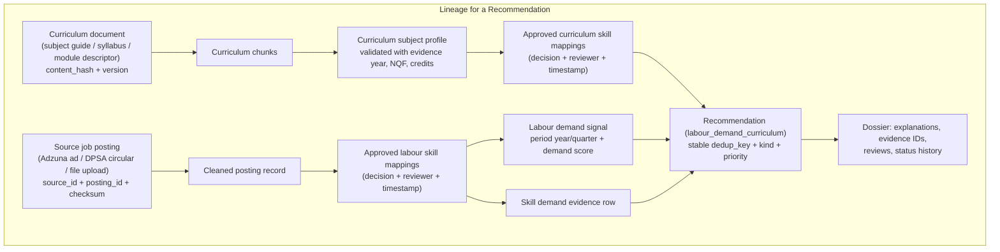

# FUTURE System — End-to-End System Guide

**Status:** Maintained · **Deployed instance:** `future_validation_2022_r3` (backend container
`future_validation_2022_r3-backend-1`, reached in a browser through the platform proxy).
**Last verified:** 2026-10-01 (portal workflow, reviewed dataset, model evaluation, recommendation
decision audit, and committee evidence-pack export).

This guide is the single ordered walk-through of the FUTURE platform for anyone who has to operate a
workflow, verify that one worked, or explain what changed end to end. It records only what the
platform actually implements: real endpoints, real scripts, real portal surfaces, and UAT evidence
that was actually run. Where a capability exists as technical UAT, synthetic evidence, or public
evidence but still needs institution-specific empirical validation, the guide says so.

> **Evidence discipline used throughout this guide**
> - **Technical UAT** — run by the research/operator team to prove a mechanism works (e.g. the
>   deterministic model-readiness UAT, the operator-held Adzuna trial postings, the offline pipeline
>   smoke tests). It is evidence about behaviour, not about the real labour market.
> - **Synthetic data** — deterministic fixtures used to exercise a pipeline offline
>   (`simulated_uat`); never empirical findings.
> - **Public evidence** — official public sources ingested with provenance (Stats SA QLFS, DPSA
>   public vacancy circulars, CHE/DHET/SAQA documents as available).
> - **Future institutional validation** — evaluation against additional institutions and programmes
>   belongs to later empirical research. It is not represented as completed in this technical test.
> - **Licensed vacancy evidence** — Adzuna approved the South African API use for this study,
>   including retention for thesis analysis, subject to attribution and working links to
>   `https://www.adzuna.co.za`.

## Current operational model status

The end-to-end mechanism is working, but the latest XGBoost candidate is deliberately **not
promoted**. The locked reviewed alignment snapshot contains **993 rows**, of which **40 are positive
(4.03%)**. Its worst chronological-fold F1 is **0**, mean chronological-fold F1 is **0.0192**, and
expected calibration error (ECE) is **0.1184**. These results demonstrate training, grouped and
chronological validation, registry recording, leakage checks, and promotion gates; they do not
support a claim of predictive adequacy.

Current audited recommendations disclose their actual method as
`canonical_signal_weighted_baseline_v2`. They must not be described as XGBoost outputs. Thousands of
approved curriculum or labour skill mappings do not automatically become model-training rows: one
alignment row is a separately reviewed curriculum-evidence/demand-evidence comparison with a 1–5
label. Increasing the number of vacancies or duplicating rows is therefore not a substitute for more
independently useful curriculum-programme comparisons.

---

## The whole system in two diagrams

### Diagram 1 — Workflow flow across the platform

### Diagram 2 — Evidence lineage from a source posting / curriculum document to a recommendation

Both diagrams reflect implemented objects: `CurriculumDocument`/`CurriculumDocumentVersion`,
`CurriculumSubjectProfile`, `SkillMapping` (source_domain `curriculum`/`labour_market`),
`JobPosting`, `LabourMarketSignal`, `SkillDemandEvidence`, `Recommendation` (type
`labour_demand_curriculum`), and the dossier/lineage builders.

---

## How to read this guide

The platform serves the same workflows through a **browser portal** (decision portal + Data
Operations + Model Lab + System Operations) and, for operators, through the **HTTP API** and the
**reproducible backend scripts** in `backend/scripts/`.

- **Portal locations** use the workspace names the frontend renders.
- **API references** use the actual prefixes registered in `backend/app/routers/`:
  `/api/v1/labour-market`, `/api/v1/curriculum`, `/api/v1/skills`,
  `/api/v1/analytics`, `/api/v1/ingestion`, `/api/v1/admin`, `/api/v1/auth`,
  `/api/v1/alignment-labels`, `/api/v1/predictive`, `/api/v1/operations`.
- **Roles** are the five implemented roles: `viewer`, `analyst`, `data_scientist`,
  `curriculum_approver`, `admin` (the portal names are Viewer, Analyst, Data Scientist,
  Curriculum Approver, Administrator).
- **Scripts** run on the backend host (or in its container) from the project root, e.g.
  `venv\Scripts\python.exe scripts\freeze_labour_evidence_snapshot.py --out-dir docs\evidence`.

Companion documents for depth: [LABOUR_MARKET_WORKFLOW.md](LABOUR_MARKET_WORKFLOW.md),
[MODEL_TRAINING_AND_EVALUATION.md](MODEL_TRAINING_AND_EVALUATION.md),
[RECOMMENDATIONS_AND_DECISION_SUPPORT.md](RECOMMENDATIONS_AND_DECISION_SUPPORT.md),
[RBAC_AND_REVIEW_WORKFLOW.md](RBAC_AND_REVIEW_WORKFLOW.md),
[DATA_PROVENANCE_AND_EVIDENCE.md](DATA_PROVENANCE_AND_EVIDENCE.md).
System concepts and component maps: [ARCHITECTURE.md](ARCHITECTURE.md) and
[DEVELOPER_GUIDE.md](DEVELOPER_GUIDE.md). Operator-facing procedures: [USER_GUIDE.md](USER_GUIDE.md)
and the deployed Help Manual (`frontend/help-manual.html`).

---

## The 21 workflows

### 1. User registration, administrator approval, RBAC role assignment, and login

**Purpose.** Let new users request access, let an administrator verify and approve them with a
least-privilege role, and let signed-in users act only within that role.

**Required roles.** Requesting: none (self-service). Approval/role assignment: `admin`
(`system.admin` permission).

**Portal location.** Login page → Decision Portal; **User Admin** (`user-admin.html`) for the
administrator.

**Inputs.** Username (3+ chars, `^[a-zA-Z0-9._-]+$`), email, password; on approval, an active
`default_role` from the role catalogue (`viewer`, `analyst`, `data_scientist`,
`curriculum_approver`, `admin`) and optional notes.

**Action sequence**
1. User calls `POST /api/v1/auth/register` (max 3 per minute). The account is created with
   `approval_status = "pending"` under the default institution tenant.
2. Administrator opens User Admin → Pending, opens the user, and either **approves** with the
   least-privileged suitable role (`PUT /api/v1/admin/users/{user_id}/approve`) or **rejects**
   with a reason (`PUT /api/v1/admin/users/{user_id}/reject`).
3. If the role is wrong later, the administrator reassigns it
   (`PUT /api/v1/admin/users/{user_id}/roles`), activates/deactivates
   (`PUT /api/v1/admin/users/{user_id}/status`), or resets a password
   (`PUT /api/v1/admin/users/{user_id}/reset-password`).
4. The user signs in (`POST /api/v1/auth/login`, max 10 per IP address). Five failed password
   attempts in the same session lock the account.
5. The user confirms identity in the page header and notes which workspaces the left menu shows.

**Expected result.** A pending account becomes **Approved** with the intended role, the user can
sign in and see exactly the pages their role permits, and any page outside the role returns access
denied (server-enforced).

**Audit and evidence.** Registration writes an `event_type=register` audit event. Approval,
rejection, role change, status change and password reset write `event_type=admin_action` with the
target user, actor, and result. Failed logins write `security` events, and five failures lock the
account. Records can be read from `GET /api/v1/admin/audit-logs`, and platform totals from
`GET /api/v1/admin/stats`.

**Common errors and recovery**
- `409` username/email already exists → use a different identity or contact an administrator.
- `429` too many registration/login attempts → wait for the rate window and retry.
- `401` invalid credentials → correct the password; repeated failures lock the account.
- `403` "Account pending admin approval" / "User inactive" → administrator must approve, or reset
  the password and status.

**API / script reference.** `auth.py` (`/register`, `/login`, `/logout`, refresh);
`admin.py` (`/users`, `/users/{id}/approve`, `/users/{id}/reject`, `/users/{id}/roles`,
`/users/{id}/status`, `/users/{id}/reset-password`, `/roles`, `/audit-logs`, `/stats`).
Test reference: `backend/tests/test_strict_academic_rbac.py`,
`backend/tests/test_unit_admin.py`.

---

### 2. Curriculum source upload and ingestion

**Purpose.** Bring an authorised curriculum document — subject guide, syllabus, module descriptor,
curriculum map, prospectus, or qualification standard — into the platform as a versioned,
hashed curriculum document that later stages can validate and extract skills from.

**Required roles.** `admin`, `analyst`, `data_scientist` (all upload and discovery endpoints).

**Portal location.** Data Operations → **Curriculum Documents** → Upload Curriculum File.

**Inputs.** A supported file (`pdf`, `docx`, `txt`, `csv`, `xlsx`) plus provenance form fields:
`title`, `faculty`, `department`, `programme`, `document_key`, `description`, `evidence_type`,
`evidence_year` (1900–2100), `currency_status` (`current|historical|expired|unknown|unverified`).
Alternatively, `POST /curriculum/documents/import-api` fetches a URL (HTTP(S), optional basic auth)
and `POST /curriculum/sources/discover` suggests links from a start page before any document is
ingested.

**Action sequence**
1. Confirm the source is authorised and the document is the correct one for the declared
   programme and evidence year.
2. Upload once. The server stages the file, computes/records integrity, and enqueues a durable job
   `ingestion.curriculum_upload`; it answers `202` with an operational job object. A `202` message
   means *queue acceptance*, not final validation.
3. Monitor the job (Data Operations → Ingestion Jobs, or the operations job endpoints) until it
   reaches **Completed**.
4. Confirm the document appears under Curriculum Evidence with a sensible page count, chunk count,
   and **active** status.

**Expected result.** A `CurriculumDocument` with one or more `CurriculumDocumentVersion` rows; the
latest version has an `extraction_status`, `content_hash`, `page_count` and `chunk_count` and is the
version later stages cite as their evidence.

**Audit and evidence.** The version stores the original filename, content hash, extraction status,
and extracted chunk count. Duplicate content is blocked by design. Upload source metadata records
`source_type` (`file` or `api`), the sanitised `endpoint_url` (for API imports), `http_status`,
`response_format`, and the declared evidence type/year/currency.

**Common errors and recovery**
- `415` unsupported suffix → use a supported file type.
- `422` invalid currency/evidence year → correct the form values.
- **Duplicate file** (same checksum already ingested) → blocked deliberately; nothing to fix unless
  a genuinely different version must supersede it.
- **Contract mismatch / unreadable PDF / empty extract** → compare the file with the source
  contract or inspect the extracted chunks; fix the file; use **Retry**. Failed jobs keep their
  diagnostics.

**API / script reference.** `curriculum.py`: `/documents/upload`, `/documents/import-api`,
`/sources/discover`, `/documents`, `/documents/{id}` (detail + versions),
`/hierarchy`, `/quality/summary`, `/cput-prospectus/courses`,
`/import/cput-prospectus`. Test reference: the curriculum upload and ingestion suites listed in
[../../backend/tests](../../backend/tests).

---

### 3. Subject-profile validation

**Purpose.** Confirm that the extracted subject profile for a curriculum document states the facts
that downstream alignment depends on: institution, faculty, department, programme name and code,
qualification type, subject name and code, evidence year, NQF level, credits, purpose, and
prerequisites — and that the reviewer has recorded a status and note.

**Required roles.** `admin`, `analyst` (editing); `data_scientist` may read/use the profiles.

**Portal location.** Data Operations → **Subject Profile Validation** → Validate / edit. The
default filter shows work that still needs review. A consolidated per-subject view is available via
`GET /curriculum/subject-profiles/consolidated`.

**Inputs.** The extracted `CurriculumSubjectProfile` rows for a version, the original chunks
(`GET /curriculum/versions/{version_id}/chunks`) to verify against, and the reviewer's corrected
reporting fields, `validation_status`, and `validation_notes`.

**Action sequence**
1. Open the profile needing review and read the purpose, prerequisites, outcomes, assessment, and
   topic evidence.
2. Correct the reporting fields, especially the canonical subject code, programme name, NQF level,
   and credits.
3. Add a concise validation note, select the status (validated / changes required / rejected), and
   save (`PATCH /curriculum/subject-profiles/{profile_id}`).
4. If a profile was rebuilt after a correction, run the rebuild endpoint
   (`POST /curriculum/versions/{version_id}/subject-profile/rebuild`) and re-validate.
5. Resolve duplicate/alias cases with the reconciliation script
   (`backend/scripts/reconcile_curriculum_module_aliases.py`) rather than validating aliases twice.

**Expected result.** Zero outstanding subject profiles; each retained subject has a validated
profile whose reporting fields match the source document and a note explaining the decision.

**Audit and evidence.** Profile rows carry `validation_status`, `validation_notes`,
`source_version_ids`, and extraction metadata (including `source_filename`). The consolidated view
lets an auditor see the latest validated value per canonical subject code.

**Common errors and recovery**
- The extractor reports zero skills/outcomes → inspect the actual chunk text before deciding.
  A zero means *no evidence of that type was found*, not that the document contains none.
- Two codes for the same subject / stale non-canonical module / wrong programme row → stop and
  reconcile (`reconcile_curriculum_module_aliases.py`) instead of reducing queue counts by
  double-validating.

**API / script reference.** `curriculum.py`: `/subject-profiles`,
`/subject-profiles/consolidated`, `PATCH /subject-profiles/{profile_id}`,
`/versions/{version_id}/subject-profile/rebuild`.
Script: `backend/scripts/reconcile_curriculum_module_aliases.py`.

---

### 4. Curriculum evidence review and approval

**Purpose.** Give every curriculum document and version an explicit human decision that the
extracted evidence is complete and correct enough to be used downstream — or a documented request
for changes.

**Required roles.** `admin`, `analyst`, `data_scientist`.

**Portal location.** Data Operations → **Curriculum Evidence Validation** → Review Evidence.

**Inputs.** The queue from `GET /curriculum/evidence-reviews/queue` (document, version, extraction
status, page/chunk counts, content hash, suggested issue codes), the version's extraction and its
chunks, and the reviewer's checklist answers.

**Action sequence**
1. Open the evidence-review queue and pick an **unreviewed** version.
2. Check the correct file/version, readable extraction, module coverage, outcome coverage, and
   assessment evidence.
3. Choose **validated** only when the checklist booleans are true and completeness is high enough;
   otherwise choose **Changes required** (or rejected) with a note. The server enforces the
   validated conditions (`decision=validated` requires the source-authoritative, extraction-
   complete, module-evidence, outcome-evidence booleans and a completeness score ≥ 80).
4. The decision is saved as a `CurriculumEvidenceReview` on the version
   (`POST /curriculum/versions/{version_id}/evidence-reviews`).
5. Once profiles and document versions are validated for a source, generate evidence mappings and
   clear the human mapping queue (see workflow 11 for the labour side; the curriculum side uses the
   same skill-mapping workbench).

**Expected result.** No unreviewed curriculum versions remain; every decision has a status, a
reviewer, a timestamp, and review history on the version.

**Audit and evidence.** Every decision is stored in `CurriculumEvidenceReview` (queryable per
version via `GET /curriculum/versions/{version_id}/evidence-reviews`), and the queue exposes the
latest review status and count per document.

**Common errors and recovery**
- Suggested issue codes (e.g. `extraction_not_completed`, `no_extracted_evidence`,
  `programme_missing`) → do not validate; fix the file/source and re-extract or update the
  document provenance, then review again.
- A prior review says validated but the extract changed → submit a new review for the latest
  version; history keeps both.

**API / script reference.** `curriculum.py`: `/evidence-reviews/queue`,
`/versions/{id}/evidence-reviews` (GET history, POST create). Downstream:
`POST /skills/extract/evidence-job` enqueues the durable `skills.extract.evidence` extraction that
feeds the mapping workbench.

---

### 5. Regulatory and institutional provenance

**Purpose.** Attach, inspect, and trace the *regulatory and institutional* evidence chain — the
national instruments (CHE/DHET/SAQA) and institutional documents that establish whether a
curriculum document is authoritative, current, and correctly positioned in the academic hierarchy.

**Required roles.** `admin`, `analyst` (record); all signed-in roles may read the chain.

**Portal location.** Data Operations → curriculum provenance views; decision portal governance
view.

**Inputs.** Document evidence rows and governance evidence rows (source type, reference, date,
description, evidence `url`/file, institution) for a document or subject.

**Action sequence**
1. Record the applicable governance evidence
   (`POST /curriculum/governance/evidence`, 201).
2. Open the chain for the relevant document/subject
   (`GET /curriculum/governance/chain`).
3. Confirm each evidence type is present and dated, and that no required national/institutional
   instrument is missing for the decision being prepared.
4. Use `GET /curriculum/evidence-types` to confirm the catalogue values for the source.

**Expected result.** The evidence chain reads national-to-institutional in order, every entry is
traceable to its instrument and date, and the chain either satisfies or documents the gap against
the decision gate it supports.

**Audit and evidence.** Governance evidence rows plus document evidence columns feed the chain
endpoint; the CPUT ADICTA pilot recorded the working example (see
[CPUT_ADICTA_UAT_AND_PROVENANCE_2026-09-06.md](CPUT_ADICTA_UAT_AND_PROVENANCE_2026-09-06.md)).
Synthetic governance UAT can be seeded with `backend/scripts/seed_synthetic_governance_uat.py`, but
synthetic rows are never labelled as real regulatory evidence.

**Common errors and recovery**
- A required instrument is absent → record it before using the document for decisions that depend
  on it; do not fake a decision_use_allowed flag for non-current evidence (`currency_status` and
  `decision_use_allowed` are captured at upload time).

**API / script reference.** `curriculum.py`: `/governance/chain`,
`/governance/evidence`, `/evidence-types`. Scripts:
`backend/scripts/seed_adicta_public_governance.py`,
`backend/scripts/seed_synthetic_governance_uat.py`.

---

### 6. Labour-source configuration

**Purpose.** Register and configure the labour-market sources the platform is allowed to read:
Stats SA QLFS (quarterly aggregate labour-force context), a DPSA public vacancy file (the current
public-service vacancy proxy), the Adzuna trial connector (operator-held trial UAT only), and the
`synthetic` provider (offline automated UAT). Configuration is recorded before ingestion and
reported per source, so a review can always tell which source produced which evidence.

**Required roles.** `admin`, `analyst`, `data_scientist` (configure and read reports).

**Portal location.** Data Operations → **Labour** area.

**Inputs.** Source metadata in `DataSource` (source category `current_jobs`, connector type,
authorisation flag, status), Stats SA QLFS parameters (2020–2025, discovery/extract options),
DPSA pilot file metadata (source label, region, country), and Adzuna credentials (see next
workflow).

**Action sequence**
1. Confirm the source register lists the intended source as authorised and current.
2. For Stats SA: configure the QLFS import window and run extraction
   (`POST /labour-market/extract/statssa`), then poll
   (`GET /labour-market/job/{job_id}`).
3. For the DPSA proxy file: upload through `POST /labour-market/jobs/upload` with the exact source
   label, region, and country (also workflow 8).
4. For any current-jobs provider, open the provider readiness report
   (`GET /labour-market/jobs/provider-readiness-report`) to confirm acquisition mode, empirical-use
   permission, signal coverage by period, and the count of mappings already decided by human review.
5. Record the findings as the readiness gate before promoting labour evidence.

**Expected result.** Every source used for evidence appears in the register with its acquisition
mode; non-empirical sources are visibly excluded from empirical findings until the
permission/licence decision is recorded.

**Audit and evidence.** `DataSource` rows and `GET /labour-market/jobs/provider-readiness-report`
are read-only views over ingestion jobs, saved postings, mapping status counts, and latest
pipeline/signal runs; the endpoint is `require_role(ADMIN/ANALYST/DATA_SCIENTIST)` and a plain
user gets `401`/`403`.

**Common errors and recovery**
- Source marked non-empirical (`ADZUNA_TRIAL_NOT_EMPIRICAL`) but used in an empirical claim →
  recovery is procedural: keep such records out of empirical gates (see workflow 21).
- QLFS labelled as vacancy-level skill demand → recovery is procedural: it is aggregate
  labour-force context only and must never be relabelled.

**API / script reference.** `labour_market.py`: `/extract/statssa`, `/job/{job_id}`,
`/jobs/upload`, `/jobs/provider-readiness-report`. `ingestion.py`: `/sources/known`,
`/operations-summary`. Public UAT evidence:
[STATS_SA_QLFS_PHASE1_PHASE2_UAT_2026-09-07.md](STATS_SA_QLFS_PHASE1_PHASE2_UAT_2026-09-07.md),
[DPSA_PHASE3_PUBLIC_VACANCY_PILOT_UAT_2026-09-07.md](DPSA_PHASE3_PUBLIC_VACANCY_PILOT_UAT_2026-09-07.md).

---

### 7. Adzuna / alternative provider configuration

**Purpose.** Configure credentials and scope for the paginated job-board connectors so the platform
can (a) import bounded pages from the **Adzuna trial** source under the operator's trial-UAT
governance, and (b) exercise the identical mechanics against the **`synthetic`** provider offline
without ever touching the live API.

**Required roles.** `admin`, `analyst`, `data_scientist` (configure/use); credentials are handled
by an operator on the backend host.

**Portal location.** Data Operations → **Labour** → Import vacancies (provider selection).

**Inputs.** For Adzuna trial: `ADZUNA_APP_ID` / `ADZUNA_APP_KEY` environment values. For synthetic:
`FUTURE_SYNTHETIC_JOBS_BASE_URL` pointing at the offline loopback fixture.

**Action sequence**
1. An operator on the backend host runs
   `backend/scripts/configure_adzuna_credentials.py`; it reads the two environment values, stores
   them encrypted (Fernet, derived from the deployment `SECRET_KEY`) in the registered
   `adzuna` source's `auth_config`, and never prints the values.
2. Confirm the source is registered in the connector registry
   (`ingestion.py:/sources/known`, `job_board_api_connector.ensure_source(db, "adzuna")`) and its
   status is trial-UAT only.
3. For offline UAT, target `provider=synthetic` and the loopback fixture, which requires no
   credentials; imported records carry source `SYNTHETIC_JOB_BOARD`, record type
   `synthetic_job_payload`, and acquisition mode `simulated_uat`, and never overwrite or purge
   stored Adzuna records.
4. After a run, `backend/scripts/inspect_adzuna_trial_uat.py` and
   `backend/scripts/inspect_empirical_readiness_uat.py` report what the trial holds and whether it
   satisfies empirical gates (it does not, until permission is recorded).

**Expected result.** Credentials exist only in encrypted source storage; every Adzuna record and
every pipeline run scoped to `ADZUNA_TRIAL_NOT_EMPIRICAL` carries `trial_scope` metadata
(`acquisition_mode: live_trial_uat`, `empirical_use_permitted: false`, unit
`trial_job_postings`, `evidence_class: trial_uat`); synthetic runs carry `simulated_uat`.

**Audit and evidence.** The readiness report lists each provider's acquisition mode and empirical
permission flag. Source constants are enforced in code:
`ADZUNA_TRIAL_SOURCE_LABEL = "ADZUNA_TRIAL_NOT_EMPIRICAL"`,
`ADZUNA_PIPELINE_RUN_KEY = "adzuna_labour_market_skill_pipeline_v1"`,
`ADZUNA_SIGNAL_RUN_KEY = "adzuna_labour_market_signal_generation_v1"`.

**Common errors and recovery**
- Credentials missing → the configure script reports the env values are absent; set them and rerun.
  Never log or paste the values.
- Trial permission refused or expired → an administrator previews and applies the targeted purge
  (`backend/scripts/purge_adzuna_trial_uat.py`); the connector and its tests remain but no trial
  records survive.
- Unknown provider / missing base URL / unauthenticated / viewer role → automated matrix proves
  these return `422`, `503`, `401`, `403` respectively (see
  [ADZUNA_PAGINATED_IMPORT_UAT_2026-09-09.md](ADZUNA_PAGINATED_IMPORT_UAT_2026-09-09.md)).

**API / script reference.** `ingestion.py`: `/adzuna/import`,
`/adzuna/pages/estimate`, `/adzuna/import-pages`, `/adzuna/posts`.
Scripts: `configure_adzuna_credentials.py`, `inspect_adzuna_trial_uat.py`,
`inspect_empirical_readiness_uat.py`, `purge_adzuna_trial_uat.py`,
`run_adzuna_trial_uat.py`. Test reference: `test_adzuna_paginated_import.py`.
UAT evidence: [JOB_BOARD_PROVIDER_ABSTRACTION_UAT_2026-09-09.md](JOB_BOARD_PROVIDER_ABSTRACTION_UAT_2026-09-09.md).

---

### 8. Vacancy ingestion: pagination, date filters, retries, deduplication

**Purpose.** Import saved job postings from a paginated job-board provider within explicit bounds,
deduplicating against postings already saved and retrying transient provider failures — without
ever retrieving "unlimited" data.

**Required roles.** `admin`, `analyst`, `data_scientist`.

**Portal location.** Data Operations → **Labour** → Import vacancies.

**Inputs.** Provider (`adzuna`, `synthetic`, or a registered file source via `jobs/upload`),
page size, start/end page range, and optional date bounds. Preview inputs: the same settings,
before the run.

**Action sequence**
1. Select the provider. For the Adzuna trial, all records are tagged
   `ADZUNA_TRIAL_NOT_EMPIRICAL`; for synthetic, `SYNTHETIC_JOB_BOARD`/
   `simulated_uat`.
2. Use **Preview request count** (`POST /ingestion/adzuna/pages/estimate`) to see exactly how many
   API requests the chosen settings would make, and the wall-time estimate. Preview never contacts
   the API.
3. Set page size (1–50) and page range (pages 1–250, at most 250 pages per run); runs longer than
   10 pages need an explicit confirmation because each page is one API request.
4. Start the import (`POST /ingestion/adzuna/import-pages`). The importer applies the enforced
   bounds (`PAGE_SIZE_MAX=50`, `PAGE_NUMBER_MAX=250`, `MAX_PAGES_PER_RUN=250`,
   `DEFAULT_PAGE_RANGE=10`), a default rate budget (`DEFAULT_REQUESTS_PER_MINUTE=30`), and retries
   individual pages with backoff (`MAX_RETRIES_PER_PAGE=2`,
   `RATE_LIMIT_RETRY_SECONDS=(5,10,20)`, `BACKOFF_SECONDS=(2,5,10)`,
   `REQUEST_TIMEOUT_SECONDS=30`).
5. Review the inserted vs duplicate counts. An **inserted** record is new and saved; a **duplicate**
   was already present for the same advertisement and is reported, not overwritten.
6. If the upstream API offers no server-side date filter, the portal applies the date range
   client-side after retrieval and counts filtered-out records separately.
7. If the provider fails repeatedly, the importer aborts cleanly with a recorded `stop_reason`
   (`aborted_after_consecutive_failures` after `CONSECUTIVE_FAILURE_ABORT=3`, or `empty_page`), and
   the already-saved pages remain.

**Expected result.** `JobPosting` rows exist for every inserted advertisement with the source,
posting id, region, country, date, and the checksum/URL lineage that later stages cite; rerunning
the same range inserts nothing new and just reports earlier records as duplicates.

**Audit and evidence.** Ingestion job rows hold job type, status, records seen/loaded/failed and
failure category/stage/error summary; the provider readiness report summarises per-source ingestion
history and saved-posting totals. See the constants and retry logic in
`backend/app/services/ingestion/adzuna_paginated_importer.py` (`_fetch_with_retry`).

**Common errors and recovery**
- `422` unknown provider / `503` missing base URL → check the provider and fixture configuration.
- Transient `500` on a page → automatic retry/backoff recovers it (proved by the automated matrix).
- Consecutive failures → recovery is procedural: fix connectivity/credentials, then rerun the
  bounded range; saved pages are never lost.

**API / script reference.** `ingestion.py`: `/adzuna/import`, `/adzuna/pages/estimate`,
`/adzuna/import-pages`, `/adzuna/posts`. `labour_market.py`: `/jobs/upload`.
UAT evidence: [ADZUNA_PAGINATED_IMPORT_UAT_2026-09-09.md](ADZUNA_PAGINATED_IMPORT_UAT_2026-09-09.md),
[ADZUNA_PORTAL_IMPORT_UAT_2026-09-08.md](ADZUNA_PORTAL_IMPORT_UAT_2026-09-08.md).

---

### 9. Saved-post browsing and pagination

**Purpose.** Browse the saved job postings that have already been imported, fifty at a time, with
previous/next navigation, without re-contacting the provider.

**Required roles.** `analyst`, `data_scientist`, `admin` (portal); signed-in users can read for
supported scopes.

**Portal location.** Data Operations → **Labour** → Show saved Adzuna posts.

**Inputs.** None beyond a valid session token; optional provider filter.

**Action sequence**
1. Open the saved-post browser.
2. Page through records fifty at a time; the UI keeps track of the current window and provides
   previous/next controls.
3. Open any record to inspect its rendered fields.

**Expected result.** Saved postings render in bounded pages with reliable navigation; browsing is
read-only and never triggers ingestion.

**Audit and evidence.** Read-only GET over saved postings (`GET /ingestion/adzuna/posts`,
`GET /labour-market/jobs`). Pagination behaviour is covered by
`backend/tests/test_adzuna_saved_posts_pagination.py`; portal/browser-safety coverage by
`backend/tests/test_adzuna_workflow_ui.py` and `backend/tests/test_frontend_syntax.py`.

**Common errors and recovery**
- Nothing listed → confirm an import ran first (workflow 8) and the provider matches the saved
  records' source.

**API / script reference.** `ingestion.py`: `/adzuna/posts`; `labour_market.py`: `/jobs`.
UAT evidence: [ADZUNA_TO_DEMAND_OUTLOOK_UAT_2026-09-08.md](ADZUNA_TO_DEMAND_OUTLOOK_UAT_2026-09-08.md).

---

### 10. Labour skill extraction

**Purpose.** Extract skills from the saved, cleaned job postings and match them to the canonical
skill catalogue (ESCO-aligned `Skill` rows), producing candidate labour-market skill mappings plus
a cleaned-posting record and normalised content for each posting.

**Required roles.** `admin`, `analyst`, `data_scientist` (run the pipeline).

**Portal location.** Data Operations → **Labour** → Process skills.

**Inputs.** The saved postings (workflow 8) and an optional `sources[]` filter (e.g.
`ADZUNA_TRIAL_NOT_EMPIRICAL` for the trial run scope).

**Action sequence**
1. Run `POST /labour-market/jobs/skill-pipeline`. The labour-market skill pipeline service
   normalises each posting's text, extracts candidate skills, and creates `SkillMapping` candidate
   rows from the actual advert text (`source_domain=labour_market`,
   `source_entity_type=job_posting`).
2. Review the result block: `postings_seen`, `cleaned_created`, `aliases_created`,
   `mappings_created`, `mappings_skipped`.
3. When scoped to the Adzuna trial, the response also carries `trial_scope` and the pipeline run is
   recorded under `ADZUNA_PIPELINE_RUN_KEY`; otherwise under
   `labour_market_skill_pipeline_v1`.
4. Inspect the generated run via `GET /labour-market/jobs/skill-pipeline/runs`.

**Expected result.** New cleaned postings and candidate mappings are recorded with audit metadata;
the mappings are *candidates* — nothing downstream promotes until human review approves them
(workflow 11).

**Audit and evidence.** Every run writes a `PipelineRun` (key, tenant, actor, parameters, summary)
and an `event_type=labour_market_skill_pipeline` audit event; structured logs record per-run
counts. The Skill Alignment validity service exposes readiness checks.

**Common errors and recovery**
- No new mappings → confirm postings exist and the source filter matches saved records.
- Trial-scoped run without trial postings → use the provider readiness report to confirm coverage,
  then re-run.

**API / script reference.** `labour_market.py`: `/jobs/skill-pipeline`,
`/jobs/skill-pipeline/runs`, `/jobs`, `/job/{job_id}`.
Script: `backend/scripts/run_labour_market_skill_pipeline_uat.py`.
Offline UAT: the labour-workflow package's clean/map/signal smoke tests and the deployed
`labour-market-smoke-*` reports under `docs/evidence/`.

---

### 11. Skill mapping review, approval, rejection, and audit

**Purpose.** Give every candidate skill mapping an accountable human (or audited auto-) decision
before any of it can become demand evidence, and keep a review history for each mapping.

**Required roles.** `admin`, `analyst`, `data_scientist` (review and decide).

**Portal location.** Data Operations → **Review mappings** (Skills Alignment workbench);
governance summary and quality queues.

**Inputs.** The candidate/needs-review queue from `GET /skills/governance/workbench` (skill name,
ESCO label, source, job title, posting id, matched text, evidence text, confidence, method), the
actual advert text for each candidate, and the reviewer's decision + note.

**Action sequence**
1. Open `GET /skills/governance/summary` (status counts, duplicates) or the workbench queue.
2. Start from the lowest-confidence candidates (the workbench orders ascending confidence) and
   review each against the actual advert excerpt: approve a genuinely taught/required skill, reject
   category words, advertising phrases, and unsupported matches (`POST
   /skills/mappings/{mapping_id}/review`, required role gate, decision + note + optional alternate
   skill).
3. Use dry-run bulk review first (`POST /skills/mappings/bulk-review?dry_run=true`), inspect the
   sample, then apply the decision for confident bands.
4. Merge duplicate skill candidates (`POST /skills/duplicates/merge`) and run the quality queues
   (low-confidence, noisy job skills, aliases, duplicates) with dry-run first.
5. High-confidence curriculum/labour mappings (`confidence >= 0.90`) that match the auto-approval
   rubric are recorded as auto-approved with audit metadata (`mapping_metadata.auto_review`), while
   uncertain ones stay in the human queue.

**Expected result.** The review queue reaches zero, every mapping has a final status
(`approved` / `rejected` / `needs_review`), a `reviewed_by`, `reviewed_at`, and a note, and the
"approved labour mappings only" gate has enough input for signal generation.

**Audit and evidence.** `SkillMappingReviewEvent` records each decision; the governance workbench
returns `review_history_count`, candidate confidence bands, and the auto-approval threshold
(`0.90`). Governance summary and `GET /admin/audit-logs` expose who reviewed what.

**Common errors and recovery**
- Over-aggressive bulk approval on noisy text → recovery: use `max_evidence_chars` and rein in
  `min_confidence`, and keep bulk decisions dry-run until the sample looks right.
- Duplicate aliases inflating counts → merge or reconcile rather than approving both.

**API / script reference.** `skills.py`: `/mappings`, `/mappings/{id}/review`,
`/mappings/bulk-review`, `/governance/summary`, `/governance/workbench`,
`/duplicates/candidates`, `/duplicates/merge`, `/extract/evidence-job`,
`/quality/low-confidence-mappings(/review)`, `/quality/noisy-job-skills(/review)`,
`/quality/aliases(/review)`, `/quality/duplicates/review`, `/merge`.
The `curriculum` side reuses the same workbench through skill harmonisation; the labour decision
log is also captured by the pipeline's operator-reviewed prototype records.

---

### 12. Demand-signal generation

**Purpose.** Turn approved labour-market skill mappings into period (year/quarter) labour demand
signals and per-skill demand evidence rows, using **approved mappings only**, so every signal is
traceable to a reviewed mapping.

**Required roles.** `admin`, `analyst`, `data_scientist`.

**Portal location.** Data Operations → **Labour** → Generate demand. The button stays disabled
until approved mappings exist; approving candidates in Skills Alignment is the prerequisite.

**Inputs.** Approved labour mappings (workflow 11) and the optional `sources[]` scope.

**Action sequence**
1. Run `POST /labour-market/jobs/skill-pipeline/signals`. The service reports
   `mappings_considered`, `mappings_approved_used`, `signals_seen/created/updated`,
   `evidence_seen/created/skipped`, and the promotion gate
   (`approved_labour_mappings_only`).
2. When scoped to the Adzuna trial, the run records under `ADZUNA_SIGNAL_RUN_KEY` and carries
   `trial_scope`; otherwise under `labour_market_signal_generation_v1`.
3. Confirm counts and audit metadata before treating signals as demand evidence.

**Expected result.** One aggregated signal row per canonical skill per period using approved
mappings only, plus demand-evidence rows linking signal → approvals → postings; candidates and
rejected mappings are excluded.

**Audit and evidence.** PipelineRun rows, `event_type=labour_market_signal` audit events, and per
signal the `method` (`job_skill_demand_v1` for the trial view), `evidence_scope`,
`evidence_count`, `demand_score`, `normalised_value`, period, unit, and confidence. The technical
UAT view `GET /labour-market/jobs/skill-pipeline/signals` returns only trial-scoped signals with
`evidence_scope=adzuna_trial_uat_not_empirical` and the trial metadata block.

**Common errors and recovery**
- Zero `mappings_approved_used` → review and approve candidate mappings first; the gate is
  enforced.
- Trial signals absent → confirm ingestion and pipeline runs were scoped to the same source label.

**API / script reference.** `labour_market.py`: `/jobs/skill-pipeline/signals` (POST generate,
GET technical-UAT view). Technical-UAT evidence:
[ADZUNA_TRIAL_END_TO_END_UAT_2026-09-08.md](ADZUNA_TRIAL_END_TO_END_UAT_2026-09-08.md),
[ADZUNA_PORTAL_END_TO_END_UAT_2026-09-09.md](ADZUNA_PORTAL_END_TO_END_UAT_2026-09-09.md).

---

### 13. Demand Outlook display

**Purpose.** Present the generated demand evidence to decision users in the Demand Outlook
(forecast) view, together with its method, maturity, and limitations.

**Required roles.** All signed-in roles can read the outlook the menu exposes; `analyst`,
`data_scientist`, `admin` operate the underlying data.

**Portal location.** Decision Portal → **Demand Outlook** / forecast view (dashboard).

**Inputs.** The signals and trends from workflows 6 and 12 and the analytics summary.

**Action sequence**
1. Open the outlook. It renders signals (`GET /labour-market/signals`), trends
   (`GET /labour-market/trends`), skill gaps
   (`GET /analytics/skill-gaps`), and forecasts (`GET /analytics/forecasts`) with source scope and
   maturity visible on each item.
2. For each item, read the confidence, method, and limitation notes before drawing conclusions.
3. Where the view exposes trial signals, note the `ADZUNA_TRIAL_NOT_EMPIRICAL` scope and the
   representativeness note.

**Expected result.** Decision users can see what is currently known about a skill's demand and
why the outlook treats it as directional rather than a guaranteed forecast.

**Audit and evidence.** The same rows are queryable through the read-only list endpoints; forecast
maturity and limitation fields are stored with the forecast rows.

**Common errors and recovery**
- Outlook empty → confirm the full chain (import → pipeline → mapping review → signals) completed;
  the Demand Outlook unlocks only once labour demand signals exist.
- Reading a trial signal as if it were empirical → treat the scope flag as authoritative; see
  workflow 21.

**API / script reference.** `labour_market.py`: `/signals`, `/trends`,
`/trends/summary`, `/signals/generate`, `/trends/normalise`. `analytics.py`: `/summary`,
`/skill-gaps`, `/skill-gaps/{id}/evidence`, `/forecasts`, `/alignment-scores`.
UAT: [ADZUNA_TO_DEMAND_OUTLOOK_UAT_2026-09-08.md](ADZUNA_TO_DEMAND_OUTLOOK_UAT_2026-09-08.md).

---

### 14. Evidence snapshot and dataset versioning

**Purpose.** Freeze a point-in-time, read-only report of the labour evidence state (sources,
ingestion jobs, postings, mapping decisions, signals, demand evidence, recent audit) so that later
stages — and later audits — can compare exactly what existed at that moment, and so dataset
versions cite stable inputs.

**Required roles.** `analyst`, `data_scientist`, `admin` (generate/inspect snapshots); all signed-in
roles can view snapshots their role permits.

**Portal location.** Reports & Exports → **Saved Evidence Snapshots**; for the dataset side,
Model Lab → dataset snapshot panel.

**Inputs.** For the labour evidence freeze: none beyond a run on the backend host. The script
`backend/scripts/freeze_labour_evidence_snapshot.py --out-dir <dir>` writes
`labour-evidence-snapshot-<stamp>.json`, its manifest, and a closure summary markdown. For reviewed
alignment data: `POST /alignment-labels/snapshots/lock`. For model datasets:
`POST /predictive/dataset-snapshots?model_type=general` returns a fingerprint + split policy.

**Action sequence**
1. (Operator) run the freeze script; it reads the live DB rows only — the script states read-only
   and performs no writes.
2. Verify the manifest lists the sections and their counts; file pairs
   (`labour-evidence-snapshot-<stamp>.json` + `-manifest-<stamp>.json`) belong together.
3. Save the snapshot pair in `docs/evidence/` and (for deployment evidence) mirror it to the host's
   evidence folder.
4. In the portal, open Reports & Exports → Saved Evidence Snapshots to inspect the recorded
   report snapshot (creator, notes, summary, full payload).
5. For training readiness, create/lock the dataset snapshot with its fingerprint before candidate
   training (see workflows 15–16).

**Expected result.** A timestamped snapshot and manifest exist, the closure summary records what was
captured, and the same numbers can be reproduced later or compared with a second freeze.

**Audit and evidence.** The freeze includes the 80 most recent audit events and the section counts
(postings, mappings with decision rows bounded, signals, evidence rows); snapshots are immutable
point-in-time records, not live data.

**Common errors and recovery**
- Snapshot missing a section → keep the paired manifest; if a section is genuinely empty the
  manifest reflects it. Re-run only if the input state changed.
- Mistaking a snapshot for live state → snapshots are fixed; consult the live endpoints for the
  current picture.

**API / script reference.** Script: `backend/scripts/freeze_labour_evidence_snapshot.py`.
Endpoints: `/analytics/reports`, `/analytics/reports/{id}`,
`/alignment-labels/snapshots`, `/alignment-labels/snapshots/latest`,
`/alignment-labels/snapshots/lock`, `/predictive/dataset-snapshots`,
`/predictive/dataset-snapshots/latest`. Evidence home: `docs/evidence/` (including the
`deploy-labour-flow-2026-09-09/` folder).

---

### 15. Model-training dataset preparation

**Purpose.** Build the deterministic, split, versioned training dataset that candidate models are
evaluated on, from approved mappings and signals, without touching live approval state.

**Required roles.** `data_scientist`, `admin` (authorise); `analyst` prepares the underlying
approved evidence.

**Portal location.** No portal edit surface — the dataset builder runs as code. Portal panels
(Model Lab) display the resulting snapshot.

**Inputs.** Approved curriculum mappings, approved labour mappings, labour demand signals, skill
demand evidence, a seed (default 42), and the split configuration.

**Action sequence**
1. Confirm the approved-evidence prerequisites (workflows 1, 4, 11, 12) are complete and the
   readiness evaluation says training is permissible
   (`inspect_empirical_readiness_uat.py` and the portal readiness gates).
2. Run the builder (`backend/app/services/labour_training_dataset_service.py`,
   method `build(...)`); it loads rows, derives features and labels deterministically, deduplicates
   by stable row key, assigns train/val/test splits by stable hash of seed+posting id, and computes
   the dataset version `labour-ds-v1-<digest16>` from inputs, seed and mask.
3. Record the fingerprint and the manifest (seed, split sizes, feature list, label column).
4. For the offline labour package, generate the dataset pack and keep it immutable alongside the
   UAT evidence.

**Expected result.** A single stable dataset version with a fingerprint, reproducible rows, and a
manifest that any evaluation run can cite. The deployed `labour-ds-v1-ea6a995f927af102` is the
verified example.

**Audit and evidence.** The manifest records seed and version; the fingerprint changes when inputs,
seed, or mask differ, so an evaluator can prove which dataset a model report belongs to.

**Common errors and recovery**
- Dataset version differs from an earlier run → inputs or seed changed; re-check the approved
  mappings/signals rather than editing the dataset.

**API / script reference.** Service:
`backend/app/services/labour_training_dataset_service.py` (`build`, `version`,
`assign_splits`, `stable_hash`). Portal snapshot endpoints: `/predictive/dataset-snapshots`,
`/predictive/dataset-snapshots/latest`.

---

### 16. Synthetic-data training and technical evaluation

**Purpose.** Train and technically evaluate candidate (baseline) models against a declared
deterministic pattern, using synthetic fixtures, to prove the training/evaluation path works and
to produce a reproducible metrics report — explicitly not a claim of empirical model validity.

**Required roles.** `data_scientist`, `admin`.

**Portal location.** Model Lab panels display the snapshot and candidate state; the UAT itself runs
as code.

**Inputs.** The deterministic synthetic fixtures from
`labour_training_dataset_service.synthetic_fixtures(size, seed)`, the readable-baseline model
(`backend/app/services/labour_baseline_model_service.py`,
`BASELINE_MODEL_VERSION = "readable-baseline-v1"` — a non-stochastic readable classifier), and the
UAT script.

**Action sequence**
1. Run `backend/scripts/run_model_training_readiness_uat.py --seed 42 --size 600`. It builds both
   the unmasked and masked-label variants of the dataset, trains/evaluates the baseline on
   each split, and writes `model-training-readiness-2026-09-09.json` (and `.md`) into
   `docs/evidence/`.
2. Read the metrics block (precision, recall, f1, accuracy, balanced accuracy) per split, the
   confusion matrix, and the versioned dataset identifier.
3. Record the deterministic equivalence: the same fixtures + seed reproduce the same numbers on any
   host (the deployed instance reproduced the local run exactly).
4. Treat the report as technical UAT about the pipeline, not empirical accuracy about the real
   market.

**Expected result.** A reproducible metrics report with a fingerprint, split sizes, and an explicit
"technical UAT / synthetic fixtures" boundary note.

**Audit and evidence.** The report file and its summary count as the evidence; the baseline model is
versioned and its classification is deterministic and inspectable.

**Common errors and recovery**
- Metrics differ between hosts → verify the same seed, size, and fixture version were used; the
  model is intentionally non-stochastic.
- No test/val rows → check the split configuration and fixture size.

**API / script reference.** Script: `backend/scripts/run_model_training_readiness_uat.py`.
Services: `labour_baseline_model_service.py`, `labour_training_dataset_service.py`.
Model registry/runtime views: `/predictive/registry/runtime-continuity`.

---

### 17. Recommendation generation and traceability

**Purpose.** Turn approved curriculum + labour evidence and demand signals into deterministic,
human-review-pending curriculum recommendations that carry the evidence they were built from.

**Required roles.** `analyst`, `data_scientist`, `admin` (run the generator); all signed-in roles
can read recommendations.

**Portal location.** Data Operations → **Labour** → 5. Recommendations; decision portal
**Recommendations** workspace.

**Inputs.** Approved curriculum mappings, approved labour mappings, labour demand signals, demand
evidence rows, and a demand threshold (default `0.15`).

**Action sequence**
1. Confirm the sequencing prerequisites: import → process skills → review mappings → generate
   demand, all complete (the Recommendations step and Demand Outlook unlock only once signals
   exist).
2. In the portal, generate eligible recommendations. The service records the method/model identity
   used for every item. The reproducible operator equivalent is
   `backend/scripts/build_labour_recommendations.py --demand-threshold 0.15`
   (`backend/app/services/labour_recommendation_builder.py`).
3. Confirm recommendation `type = labour_demand_curriculum`; each item gets `kind`
   (`curriculum_gap` high priority `0.90`, or `curriculum_coverage` medium `0.60`), a stable
   `dedup_key` (hash of type, kind, skill, period), an explanation, and source ids (signal,
   evidence, mappings, source, period).
4. Verify duplicates: the generator skips rows whose `dedup_key` already exists, so rerunning adds
   nothing.
5. Review the generated rows in the recommendations workspace; they are created `pending_review`
   and never auto-approve curriculum change.

**Expected result.** New recommendations with traceable evidence IDs, an explicitly disclosed
method/model identity, and status `pending_review`; duplicate reruns report 0 new. A recommendation
is decision support and never silently changes curriculum.

**Audit and evidence.** Each recommendation carries evidence ids, source and period, explanation,
and review status; the generator writes a run report to `docs/evidence/` including the dedup
summary.

**Common errors and recovery**
- Zero recommendations → check the demand threshold against signal values and confirm approved
  mappings exist on both sides.
- Duplicate rush to approve → the dedup_key makes reruns safe; there is no overwrite.

**API / script reference.** Script: `backend/scripts/build_labour_recommendations.py`.
Service: `labour_recommendation_builder.py`. Read endpoints:
`/analytics/recommendations`, `/analytics/recommendations/grouped`. The older analytics generator
also exists (`analytics_recommendation_service.generate_recommendations`, `/analytics/generate`);
the labour demand–curriculum recommendation type supersedes it for labour evidence.

---

### 18. Decision-support review and decision history

**Purpose.** Let governance review a recommendation dossier and record approve / reject / modify
decisions (and, uniquely, the *final academic approval* by the Curriculum Approver) with a written
rationale, and let auditors read the full decision history.

**Required roles.** Review/read: all signed-in roles. Final academic approve/reject/modify:
exclusively `curriculum_approver` (`recommendation.academic_approve`); administrators cannot
perform it.

**Portal location.** Decision Portal → **Recommendations** → dossier; **Decision History** view.

**Inputs.** A recommendation's dossier (`GET /analytics/recommendations/{id}/dossier`), its
lineage (`GET /analytics/recommendations/{id}/lineage`), explanations
(`GET /analytics/recommendations/{id}/explanations`), and the reviewer's rationale.

**Action sequence**
1. Open the recommendation and inspect the dossier: curriculum and labour evidence, demand
   evidence, explanations, forecasts, reviews, feedback, and status history.
2. Verify the evidence is recent, from credible sources, and the explanation matches the question.
3. Record approve / reject / modify with a mandatory evidence-based rationale
   (`POST /analytics/recommendations/{id}/approve|reject|modify`); modify resubmits edited content.
4. Add optional feedback (`POST /analytics/recommendations/{id}/feedback`).
5. Give the final academic approval only when acting as the Curriculum Approver; the server enforces
   the permission.
6. Confirm the decision appears in Decision History with author, rationale, timestamp, evidence
   links, dataset/source provenance, and method identity.
7. When governance readiness passes, generate the committee evidence pack. Record the generated
   report ID, source-manifest ID/hash and payload SHA-256, then download the portal PDF.

**Expected result.** The recommendation's status changes immediately; every decision, feedback, and
status change is visible on the item, and the governance view shows the full history.

**Audit and evidence.** Recommendation reviews, feedback rows, and status-history rows are all
persisted and exposed (`/recommendations/{id}/reviews`,
`/recommendations/{id}/feedback`, `/recommendations/{id}/status-history`). Committee support is
available via `POST /analytics/recommendation-governance/committee-pack` and
`POST /analytics/recommendations/{id}/committee-decision`, gated on the
`recommendation.academic_approve` permission.

**Common errors and recovery**
- No "Approve" button despite being a Curriculum Approver → refresh the session; access checks
  are server-side and administrators do not see the control by design.
- Revising a recommendation that was already decided → use modify only when eligible; history keeps
  both states.

**API / script reference.** `analytics.py`: `/recommendations`,
`/recommendations/grouped`, `/recommendations/{id}/dossier`, `/dossier/report`,
`/lineage`, `/explanations`, `/approve`, `/reject`, `/modify`, `/feedback`,
`/reviews`, `/status-history`, `/recommendation-governance/readiness`,
`/recommendation-governance/committee-pack`, `/recommendations/{id}/committee-decision`.

---

### 19. Reports and exports

**Purpose.** Produce decision-ready, exportable records (CSV/PDF/JSON) and saved evidence snapshot
reports for committees, governance, and curriculum review, each with a payload hash so the export
can be verified.

**Required roles.** Viewer and above can read/export within role permissions; analyst and above can
generate snapshots.

**Portal location.** Reports & Exports workspace (dashboard view), and the generated-report list
(`GET /analytics/reports`).

**Inputs.** The report row (e.g. recommendation evidence dossier, alignment, quality, forecast) and
its detail.

**Action sequence**
1. Open Reports & Exports → select the report type.
2. Generate or select a saved report; exports download to the browser's download folder.
3. Where a snapshot is saved (`/analytics/reports`), open **View** to read its creator, notes,
   summary, and full payload, and compare snapshots to show what the system knew at different
   times.
4. A Curriculum Approver opens the eligible recommendation, reviews its evidence, and selects
   **Generate committee evidence pack**. The portal saves the immutable report before downloading
   the PDF.
5. Record the report ID, source-manifest ID/hash and payload SHA-256 shown by the portal. A PDF file
   checksum may additionally be calculated for the exact downloaded file.

**Expected result.** Every exported report has content, a payload hash, a creator, and a timestamp;
snapshots are immutable.

**Audit and evidence.** GeneratedReport rows carry `report_type`, `source_entity_id`,
`payload_hash`, `status`, and the generating user; report generation is audited (e.g.
`event_type=recommendation_report` for dossier reports).

**Common errors and recovery**
- No snapshots present → reports are generated only from eligible evidence; run the prerequisite
  workflows first.
- Export differs from a snapshot → snapshots are fixed records; current data changes with new
  evidence.

**API / script reference.** `analytics.py`: `/reports`, `/reports/{id}`,
`/recommendations/{id}/dossier/report`, `/analytics/generate`,
`/recommendation-governance/committee-pack`.

---

### 20. Failure handling, retry, backup, and recovery

**Purpose.** Keep the platform auditable and recoverable: durable jobs record failures, can be
retried or cancelled, backups are encrypted and verified, restore is rehearsed on an isolated
target, and deployment/rollback is rehearsed before it is ever needed for real.

**Required roles.** `admin` (`operations` surface); analysts may inspect job rows and evidence.

**Portal location.** System Operations → Health Evaluation, Performance, Backups, Restore
readiness, Rollback status, Portal UAT.

**Inputs.** The failed job identifier, the backup request, the manifest path, the release bundle
(for application rehearsal), and the temporary-database authority (for migration/restore
rehearsal).

**Action sequence**
1. Detect: run System Operations → **Measure Performance** (`/operations/performance`) and
   Health Evaluation (`/operations/monitoring/evaluate`); acknowledge alerts
   (`POST /operations/alerts/{id}/acknowledge`) — acknowledgement assigns investigation, it does
   not fix the alert.
2. Diagnose: open the job row (`/operations/jobs`, `/operations/jobs/{id}`) and read the failure
   category/stage/error summary (duplicate file, contract mismatch, unreadable file, empty
   extract, provider outage).
3. Recover: fix the cause and **Retry** (`POST /operations/jobs/{id}/retry`) or cancel
   (`POST /operations/jobs/{id}/cancel`); failed jobs keep their diagnostics for audit.
4. Back up: queue an encrypted backup (`POST /operations/backups/create`, 202) then load Backup
   Status (`/operations/backups`); retention is applied only via
   (`POST /operations/backups/retention/apply`)
   and backups are verified against their manifest
   (`POST /operations/backups/manifest`).
5. Rehearse restore: run the isolated restore drill
   (`POST /operations/backups/restore-drill`, 202) only when the portal confirms temporary-
   database authority — the live database is never the restore target.
6. Rehearse releases: application rehearsal (`POST /operations/rollback/application-rehearsal`,
   202) verifies a release bundle; migration rehearsal
   (`POST /operations/rollback/database-rehearsal`, 202) uses a generated temporary database and
   stays blocked without separate authority.
7. Record acceptance: run Portal UAT (`POST /operations/portal-uat/run`), which records role,
   page, API, and safety-control acceptance evidence — it is not a performance or accuracy test.

**Expected result.** Every failure has an owner, a documented cause, and a result; backups and their
manifests are current; restore and release drills complete on their isolated targets; the UAT log
records the run.

**Audit and evidence.** Durable jobs, `AuditEvent` rows for each operational action, backup
manifests with payload hashes, and the portal-UAT latest record
(`GET /operations/portal-uat/latest`) plus `GET /operations/research-claims` and
`/operations/research-claims/archive` for the claims catalogue.

**Common errors and recovery**
- Restore drill without authority → blocked by design; request the temporary-database authority.
- Backups not running → treat the alert as an owner + action item; backup duration/uptime metrics
  reset on backend restart and production history still requires the external monitoring service.

**API / script reference.** `operations.py` (all `/operations/*` routes listed above),
`monitoring_alert_service.py`, `backup_restore_service.py`,
`deployment_rollback_service.py`, `security_operations_service.py`,
`operational_job_service.py`.

---

### 21. Known limitations and deferred empirical validation

**Purpose.** State plainly what the system has *not* yet validated, so no operational evidence is
lifted into empirical claims.

**Known limitations (implemented and disclosed)**

- **Adzuna trial is not empirical.** The trial source label is
  `ADZUNA_TRIAL_NOT_EMPIRICAL`; acquisition mode `live_trial_uat`;
  `empirical_use_permitted: false`. Trial records cannot satisfy empirical readiness, forecasting,
  or publication gates until written permission/licence is recorded. If permission is refused or
  expires, `purge_adzuna_trial_uat.py` removes the trial records while the connector and tests
  remain.
- **Synthetic provider is simulated UAT.** Records carry `simulated_uat` and source
  `SYNTHETIC_JOB_BOARD`; they demonstrate mechanics only.
- **Model-readiness UAT is deterministic, not empirical.** The training/evaluation UAT runs on
  synthetic fixtures (`--seed 42 --size 600`) and a readable non-stochastic baseline; its metrics
  (e.g. the deployed accuracy 0.52 / F1 0.36 report) prove the pipeline behaves reproducibly, not
  that the real labour market was modelled accurately.
- **Stats SA QLFS is aggregate labour-force context.** It must never be relabelled as vacancy
  counts, monthly skill demand, or direct employer requirements.
- **The DPSA phase-3 proxy is a five-record public-service vacancy sample** from one circular and
  one provincial department — not representative of the Western Cape or the private-sector ICT
  labour market, and insufficient for forecasting.
- **Forecasts are directional.** Every forecast has a maturity status and explicit limitation;
  short histories produce prototype-grade output.
- **Researcher-controlled identities.** RBAC and workflow UAT used accounts created by the
  researcher; those are not independent participants or expert validation.

**Deferred validation**

- Independent expert / institutional validation of alignment labelling (two independent reviewers)
  and of curriculum evidence authority.
- The Adzuna terms decision (consent/licence) that would allow empirical use.
- Real training data volume and external monitoring/alert delivery ownership.
- Publishing a promoted model requires an administrator activation recorded with evidence gates
  passed; none is claimed here.

**Operating rule.** The same evidence discipline that produced section-by-section UAT artifacts in
`docs/evidence/` must be followed for anything newly deployed: label the evidence class, keep the
snapshot, and update this guide.

---

## Reading order and signposting

For a quick operator path: workflows 1 → 6 → 7 → 8 → 10 → 11 → 12 → 13 → 17 → 18.
For the data scientist path: 1 → 2–5 (curriculum) → 14 → 15 → 16.
For the governance path: 4 → 5 → 11 → 17 → 18 → 19.
For audit: 14 → 20 → 21.

Existing UAT evidence documents referenced above live in `docs/system_documentation/`; evidence
artifacts live in `docs/evidence/`. The evidence index is
[`../evidence/end-to-end-documentation-index.md`](../evidence/end-to-end-documentation-index.md).
